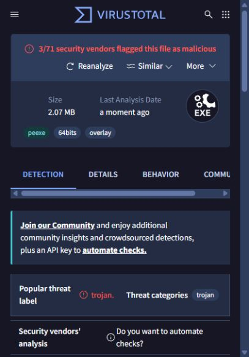

# v1.0.1 comparison build / Vergleichsbuild

## Deutsch

Der Vergleichsbuild nutzt PyInstaller als Programmordner (`--onedir`) ohne UPX, mit separatem `runtime`-Ordner und Windows-Versionsinformationen. Funktionstests und der Starttest bestanden. Die App-Funktionen und Schutzregeln wurden nicht verändert. Diese Version ist weiterhin unsigniert und noch kein veröffentlichtes Release.

Am 04.10.2026 um 23:15:35 Uhr (Europe/Berlin) zeigte der abgeschlossene EXE-Scan **3/71 Erkennungen**, verglichen mit 9/71 für v1.0.0. Microsoft: `Trojan:Win32/Wacatac.C!ml`; SecureAge: `Malicious`; Skyhigh (SWG): `BehavesLike.Win64.Backdoor.vc`. Die verbliebenen Meldungen sind ungeklärt. Weniger Erkennungen beweisen weder Sicherheit noch einen Fehlalarm. Der Scan betrifft nur die EXE, nicht alle separaten Laufzeitdateien oder das vollständige ZIP.

Nächster sinnvoller Schritt: Verdachtsmeldungen zur Prüfung bei den betroffenen Herstellern einreichen. Eine spätere Codesignatur kann Herkunft und Integrität belegen, garantiert aber kein unauffälliges Scanergebnis. Virenschutz nicht deaktivieren.

## English

The comparison build uses PyInstaller directory packaging (`--onedir`) without UPX, with a separate `runtime` folder and Windows version information. Functional tests and the executable startup test passed. Application behavior and protection rules were unchanged. This build remains unsigned and is not a published release.

The completed EXE scan on October 4, 2026 at 23:15:35 (Europe/Berlin) reported **3/71 detections**, compared with 9/71 for v1.0.0. Microsoft: `Trojan:Win32/Wacatac.C!ml`; SecureAge: `Malicious`; Skyhigh (SWG): `BehavesLike.Win64.Backdoor.vc`. These detections remain unresolved. Fewer detections establish neither safety nor a false positive. The scan covers only the EXE, not all separate runtime files or the complete ZIP.

The next useful step is vendor review of the suspected detections. Future code signing can establish publisher identity and integrity, but cannot guarantee a clean scan. Do not disable antivirus protection.

[VirusTotal report](https://www.virustotal.com/gui/file/2050e02a807c3cfcb9e54c1743c40dc839f59668d535878f95c915f661eb7a46)

EXE SHA-256: `2050e02a807c3cfcb9e54c1743c40dc839f59668d535878f95c915f661eb7a46`

Comparison ZIP SHA-256 (not scanned): `39f263fa82af57f1d4eedf9e808b00e036fe89fec1d24ef1bf4731e972da4c61`

