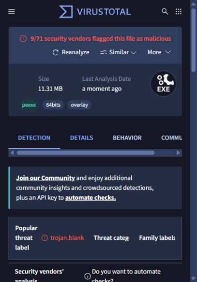

# VirusTotal · v1.0.0

## Deutsch

Die veröffentlichte `FoxholeModUpdater.exe` wurde am **04.10.2026** bei VirusTotal
eingereicht. Der abgeschlossene Bericht zeigte **9/71 Erkennungen**. Dies ist
kein unauffälliges Ergebnis. Die Ursache wurde noch nicht untersucht; mögliche
Fehlalarme sind nicht bestätigt. Weder ein Quellcode-Review noch ein funktionaler
Test ersetzt diese Untersuchung. Virenschutz nicht deaktivieren, um die EXE auszuführen.

Der Scan bezieht sich auf die EXE im Windows-ZIP von v1.0.0, nicht auf das ZIP
selbst oder spätere Builds. Erkennungen können sich nach diesem Zeitpunkt ändern.

## English

The published `FoxholeModUpdater.exe` was submitted to VirusTotal on **October 4,
2026**. The completed report showed **9/71 detections**. This is not a clean result.
The cause has not been investigated; possible false positives are not confirmed.
Neither a source review nor functional testing replaces that investigation.
Do not disable antivirus protection to run the EXE.

The scan applies to the EXE contained in the v1.0.0 Windows ZIP, not to the ZIP
itself or subsequent builds. Detection results can change after this snapshot.

## Datei / File

- Filename: `FoxholeModUpdater.exe`
- Size: 11.31 MB (VirusTotal display)
- SHA-256: `83ba51bcef3d871d3e65b486e2da976692d0617d9255235d26358c509f247cf6`
- [VirusTotal report](https://www.virustotal.com/gui/file/83ba51bcef3d871d3e65b486e2da976692d0617d9255235d26358c509f247cf6)

## Gemeldete Erkennungen / Reported detections

| Vendor | Detection |
|---|---|
| Arctic Wolf | Unsafe |
| Bkav Pro | W32.Malware.DC0B8750 |
| DeepInstinct | MALICIOUS |
| Elastic | Malicious (moderate Confidence) |
| Microsoft | Trojan:Win32/Wacatac.B!ml |
| SecureAge | Malicious |
| SentinelOne (Static ML) | Static AI - Suspicious PE |
| Skyhigh (SWG) | BehavesLike.Win64.Backdoor.wc |
| Zillya | Trojan.Blank.Script.2228 |

